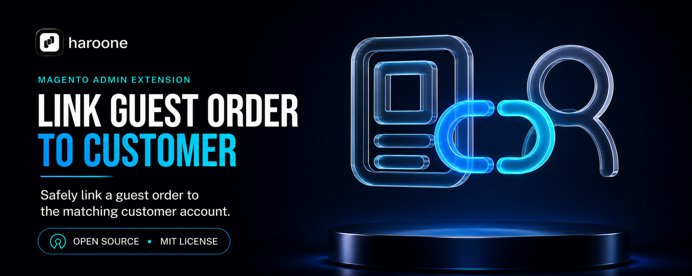

# Link Guest Order to Customer for Magento 2

[](https://github.com/haroonsulahri/magento-link-guest-order-to-customer/actions/workflows/quality.yml)
[](https://packagist.org/packages/haroone/module-link-guest-order-to-customer)
[](LICENSE.txt)

Connect an eligible guest order to the matching customer account from Magento Admin.

A free, open-source Magento extension built and maintained by [Haroone](https://haroone.com/).

[Install](#installation) · [How it works](#what-it-does) · [Admin usage](#admin-usage) · [Support](#support-and-magento-services) · [Contribute](CONTRIBUTING.md)

## Installation

### Composer installation

Install the latest stable release from [Packagist](https://packagist.org/packages/haroone/module-link-guest-order-to-customer):

```bash
composer require haroone/module-link-guest-order-to-customer:^1.0.2

bin/magento module:enable Haroone_LinkGuestOrderToCustomer
bin/magento setup:upgrade
bin/magento setup:di:compile
bin/magento cache:clean
```

### Manual installation

Download or clone the repository into:

```text
app/code/Haroone/LinkGuestOrderToCustomer
```

Then run from the Magento root:

```bash
bin/magento module:enable Haroone_LinkGuestOrderToCustomer
bin/magento setup:upgrade
bin/magento setup:di:compile
bin/magento cache:clean
```

No database tables are added. Reindexing and static-content deployment are not required for this module.

### Updating an existing installation

Review the [GitHub release notes](https://github.com/haroonsulahri/magento-link-guest-order-to-customer/releases) before updating and use the store's normal maintenance and deployment process in production.

For a Composer installation, update only this package and confirm the resolved version:

```bash
composer update haroone/module-link-guest-order-to-customer
composer show haroone/module-link-guest-order-to-customer

bin/magento cache:clean config layout block_html
```

For a manual installation, back up the current `app/code/Haroone/LinkGuestOrderToCustomer` directory outside `app/code`, replace the directory with the files from the latest release ZIP, and then run:

```bash
bin/magento module:status Haroone_LinkGuestOrderToCustomer
bin/magento cache:clean config layout block_html
```

Replace the complete manual-installation directory instead of merging old and new release files. Run `setup:upgrade`, DI compilation, static-content deployment or reindexing only when the relevant release notes require them. The current `v1.0.2` release does not require those additional steps.

### Migrating from the legacy package

The renamed package starts at version 1.0.1. If `haroone/module-guest-order-link` or `Haroone_GuestOrderLink` is already installed, follow the complete [legacy-package migration guide](UPGRADING.md) so Magento never loads both module identities during the change. The rename does not change sales or customer data.

## Why this module exists

A shopper can place an order as a guest and create an account later with the same email address. Magento does not automatically make every earlier guest order belong to that new account. Support teams are then left with a customer who is signed in but cannot find the order under **My Account > My Orders**.

This module gives an authorized Admin user a controlled way to link one guest order to the exact matching account. It does not bulk-claim order history or let an Admin choose an arbitrary customer.

## What it does

- Adds **Link to Customer Account** immediately before **Edit** on an eligible Admin order.
- Shows the action only when an exact account-email match exists in the applicable customer-sharing scope.
- Displays a confirmation page before anything is changed.
- Revalidates the order and customer immediately before saving.
- Uses Magento's native customer-assignment service instead of direct SQL.
- Records a private audit comment with the trusted Admin display name.
- Refreshes the affected sales grid after assignment.
- Uses a per-order lock to reduce concurrent assignment attempts.
- Protects the UI and controllers with a dedicated ACL permission.

## Eligibility and safety

The action is available only when the order is still an unassigned guest order, contains an email address, and has one exact customer match in Magento's configured global or per-website account-sharing scope. The Admin role must also have the module permission.

The same checks run when the confirmation page opens and again when the POST request is submitted. A stale page therefore cannot bypass the rules.

The module deliberately does not:

- reassign an order that already belongs to a customer;
- match customers by name or a submitted customer ID;
- create customer accounts or addresses;
- bulk-link historical orders;
- change order status, totals, payment, addresses, items or quote data;
- add a storefront endpoint, telemetry or external service call.

After linking, storefront visibility still follows Magento's normal order-status configuration. The confirmation page warns the Admin when the current status is not visible on the storefront, but the module does not change that global setting.

## Requirements

- Magento Open Source or Adobe Commerce with component versions allowed by [`composer.json`](composer.json)
- PHP 8.1 or newer, using a PHP version supported by the installed Magento release
- An Admin role with `Haroone_LinkGuestOrderToCustomer::link`

The package constraints begin with Magento 2.4.4-era component versions and continue through compatible newer releases. Composer checks these requirements during installation and rejects incompatible Magento or PHP combinations.

## Admin usage

1. Open **Sales > Orders**.
2. Open an unassigned guest order.
3. Click **Link to Customer Account** next to **Edit**.
4. Check the order and matched account on the confirmation page.
5. Click **Link to Customer Account**.
6. Confirm the order is assigned to the customer. If the order status is storefront-visible, confirm it also appears under **My Account > My Orders**.

Grant access under:

```text
Sales > Operations > Orders > Actions > Link Guest Order to Customer
```

## Development and verification

Run the unit suite from a Magento root with development dependencies:

```bash
vendor/bin/phpunit -c app/code/Haroone/LinkGuestOrderToCustomer/phpunit.xml.dist
```

The repository's package-quality workflow validates Composer metadata, PHP syntax, XML, privacy checks and the Linux release archive. The separate Magento workflow installs a clean Magento instance and runs unit tests, coding standards, PHPStan, DI compilation and integration tests when `COMPOSER_AUTH` is configured.

See:

- [Validation guide](docs/validation.md)
- [Privacy and data handling](docs/privacy.md)
- [Release process](docs/releasing.md)
- [Brand assets](docs/branding.md)
- [Contributing](CONTRIBUTING.md)
- [Security policy](SECURITY.md)

## Privacy and security

The module sends no data outside Magento. Its private order-history comment contains only the trusted Admin display name. Structured application logs contain entity IDs only and never include customer names, email addresses, Admin names, submitted form values or exception objects.

Report security issues privately as described in [SECURITY.md](SECURITY.md). Do not put customer data, credentials, order exports or vulnerabilities in a public issue.

## Support and Magento services

[Haroone](https://haroone.com/) is an ecommerce engineering company led by Magento expertise. The team works on custom modules, checkout and Admin workflows, migrations and upgrades, integrations, performance, technical SEO and ongoing production support.

Use [GitHub Issues](https://github.com/haroonsulahri/magento-link-guest-order-to-customer/issues) for reproducible product bugs and feature requests. If the problem belongs to one store rather than the open-source package, contact Haroone privately with the store context.

- [Link Guest Order to Customer on Haroone.com](https://haroone.com/extensions/magento-2-link-guest-order-to-customer)
- [Magento engineering services](https://haroone.com/services/magento)
- [Other free Magento extensions](https://haroone.com/extensions)
- [Private support and project enquiries](https://haroone.com/contact)
- [Contribution guidelines](CONTRIBUTING.md)

## License

Released under the [MIT License](LICENSE.txt). Copyright © 2026 Haroone.com.
