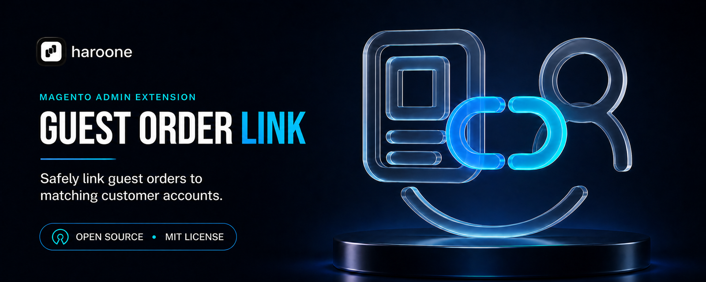

# Haroone Guest Order Link for Magento 2

Safely link an eligible guest order to the matching registered customer account from Magento Admin.

## The Magento problem this module solves

Magento allows shoppers to place orders without creating a customer account. If a guest later creates an account through a separate registration flow using the same email address, the earlier order can remain stored as a guest order with no customer account assigned to it. An email match alone does not make that account the owner of the existing order.

This creates a common support problem:

1. A shopper completes checkout as a guest.
2. The shopper later creates a customer account using the same email address.
3. The original order remains unassigned in Magento.
4. The customer cannot access that order from **My Account > My Orders**, subject to Magento's normal order-status visibility rules.
5. Magento Admin does not provide a general, controlled action for assigning that individual guest order to the matching account.

Magento can associate an order when account creation happens through supported post-checkout registration flows. This module addresses the separate case where an order remains unassigned after the account has been created.

## Purpose

Haroone Guest Order Link gives an authorized administrator a deliberate way to connect one existing guest order to one existing customer account. The module resolves the customer from the order email, respects Magento's configured customer-account sharing scope, displays both records for confirmation, and revalidates everything before saving.

The workflow is intentionally conservative. It does not search by name, accept an arbitrary customer ID, create a customer, or automatically claim every historical order with the same email address. This reduces the risk of assigning an order to the wrong account.

## Typical use case

A customer contacts support because an order placed before registration is missing from the customer account. An authorized Admin opens the guest order. When an exact eligible customer account exists, the module displays **Link to Customer Account** immediately before **Edit**. The Admin reviews the proposed assignment on a confirmation page and submits it. Magento then associates the order with that customer account.

## Features

- Adds **Link to Customer Account** immediately before **Edit** on eligible Admin order pages.
- Shows the action only when an exact customer-email match exists in Magento's applicable customer-sharing scope.
- Presents a confirmation page before changing the order.
- Revalidates eligibility immediately before saving.
- Uses Magento's native customer-assignment service instead of direct SQL.
- Adds a private audit comment containing the trusted Admin display name, without customer IDs, customer emails, or Admin IDs.
- Refreshes the affected sales grid after a successful assignment.
- Uses a per-order lock to reduce concurrent assignment risk.
- Protects the button and controllers with a dedicated ACL resource.
- Adds no database tables, storefront assets, telemetry, or external service calls.

## Eligibility requirements

The Admin action is available only when all of the following conditions are satisfied:

| Requirement | Reason |
| --- | --- |
| The Admin role has the module's ACL permission | Prevents unauthorized order assignment |
| The order is still marked as a guest order | Prevents changing normal registered-customer orders |
| The order has no customer ID assigned | Prevents reassignment of an existing association |
| The order contains a customer email address | Provides the trusted lookup value |
| An account with that exact email exists | Avoids approximate or name-based matching |
| The account is valid within Magento's configured sharing scope | Prevents unintended cross-website assignment |

If any requirement is not met, the button is not displayed. The same checks run again when the confirmation page is opened and immediately before the assignment is saved, so a stale Admin page cannot bypass the rules.

## How the assignment works

1. The order view button requests a server-side eligibility check.
2. The module reads the email already stored on the guest order.
3. Magento's customer repository resolves the exact account in the applicable global or per-website customer-sharing scope.
4. A confirmation page shows the order and resolved account to the authorized Admin.
5. The final action is submitted with a POST request protected by Magento's form key validation.
6. Eligibility is revalidated and a per-order lock reduces concurrent assignment attempts.
7. Magento's native customer-assignment service associates the order with the resolved account.
8. A private, non-customer-visible audit comment records the trusted Admin display name.
9. The affected sales grids are refreshed.

After a successful assignment, the order belongs to the customer account. Whether it is visible in **My Orders** still depends on Magento's existing storefront order-status visibility configuration. The module warns the Admin when the current status is not configured for storefront display, but it does not change that global configuration.

## Safety boundaries

The module does not:

- automatically link historical orders by email;
- bulk-link multiple orders;
- reassign an order that already belongs to a customer;
- create a new customer account;
- select a customer by name or accept an arbitrary customer ID;
- link across websites when customer accounts are shared per website;
- modify order state, status, totals, payment, addresses, quote, or items;
- change global order-status storefront visibility;
- create or update customer addresses;
- expose a customer-facing linking endpoint.

## Compatibility

The Composer constraints target Magento Open Source and Adobe Commerce 2.4.4 or newer, with a PHP version supported by the installed Magento release.

| Magento | PHP | Verification status |
| --- | --- | --- |
| 2.4.6-p12 | 8.3 | Unit, static, compilation, package and local runtime verification completed |
| Other releases allowed by `composer.json` | Magento-supported version | Not yet verified in the public CI matrix |

Compatibility outside the verified row should be tested in a disposable Magento environment before production deployment.

## Installation with Composer

After the package is published to a Composer repository:

```bash
composer require haroone/module-guest-order-link
bin/magento module:enable Haroone_GuestOrderLink
bin/magento setup:upgrade
bin/magento setup:di:compile
bin/magento cache:clean
```

## Manual installation

Copy the module to:

```text
app/code/Haroone/GuestOrderLink
```

Then run:

```bash
bin/magento module:enable Haroone_GuestOrderLink
bin/magento setup:upgrade
bin/magento setup:di:compile
bin/magento cache:clean
```

The module has no declarative schema and does not require reindexing or static-content deployment.

## Admin usage

1. Open **Sales > Orders**.
2. Open an unassigned guest order.
3. Click **Link to Customer Account**.
4. Review the order and resolved customer account.
5. Click **Link Order to Customer**.
6. Confirm the order appears in the customer's **My Orders** collection.

The action is hidden when no exact match exists, the order is already assigned, the order is not a guest order, or the Admin role lacks permission.

## Permission

Grant the role permission under:

```text
Sales > Operations > Orders > Actions > Link Guest Orders to Customer Accounts
```

The ACL resource is `Haroone_GuestOrderLink::link`.

## Testing

Run the unit suite from a Magento root containing development dependencies:

```bash
vendor/bin/phpunit -c app/code/Haroone/GuestOrderLink/phpunit.xml.dist
```

Run the Magento integration test in a dedicated integration-test database:

```bash
cd dev/tests/integration
../../../vendor/bin/phpunit -c phpunit.xml.dist \
  ../../../app/code/Haroone/GuestOrderLink/Test/Integration
```

See [docs/validation.md](docs/validation.md) for the complete test matrix and [docs/privacy.md](docs/privacy.md) for data-handling details.

The dependency-free package workflow runs on every push and pull request. Maintainers can run the Magento verification workflow after configuring the repository's `COMPOSER_AUTH` secret for `repo.magento.com`; it installs a clean Magento instance and runs unit, coding-standard, PHPStan, DI compilation and integration checks.

## Brand assets

The canonical extension artwork is stored with the repository:

- [Extension icon SVG](docs/images/guest-order-link-icon.svg): scalable production source for repository and marketplace use.
- [Extension icon PNG](docs/images/guest-order-link-icon.png): 512 x 512 transparent fallback for Haroone.com listings, package directories and square thumbnails.
- [Extension banner](docs/images/guest-order-link-banner.png): 1600 x 640 PNG for repository documentation and extension headers.
- [Haroone logo badge SVG](docs/images/haroone-logo-badge.svg): production source for the rounded black banner lockup.
- [Haroone logo badge PNG](docs/images/haroone-logo-badge.png): 256 x 256 transparent fallback.

Keep the original aspect ratios and do not add store, customer or environment-specific information to these public assets. The deep-navy linework and blue-to-cyan linking accent form the reusable visual system; the order-to-customer symbol identifies this module specifically.

The square extension icon uses a deep-navy monoline order-to-customer symbol, a blue-to-cyan linking accent and a single lower assignment curve. It intentionally contains no Haroone logo or wordmark. The Haroone logo is reserved for the banner, where it remains clearly readable.

## Support and security

Use the repository's Issues tab for non-sensitive defects and feature requests. Follow [SECURITY.md](SECURITY.md) for private vulnerability reporting.

## License

MIT. See [LICENSE.txt](LICENSE.txt).
